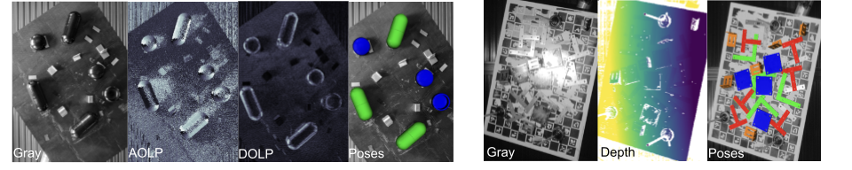
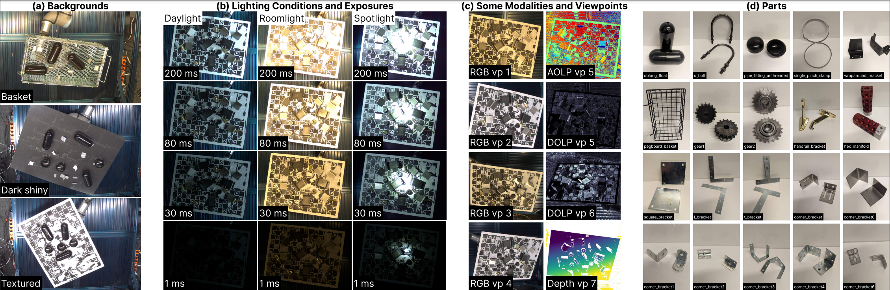
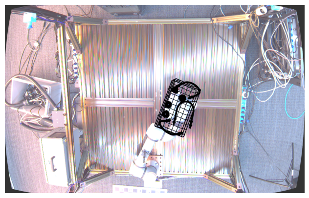
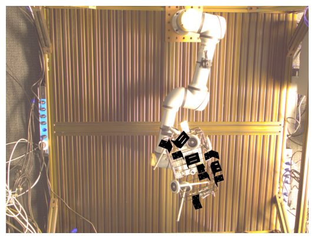
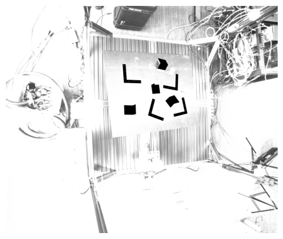
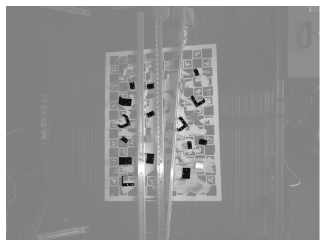

# Industrial Plentopic Dataset



Accepted at CVPR 2024!

# Abstract
6DoF Pose estimation has been gaining increased importance in vision for over a decade, however it does not yet meet the reliability and accuracy standards for mass deployment in industrial robotics. To this effect, we present the Industrial Plenoptic Dataset (IPD): the first dataset and evaluation method for the co-evaluation of cameras, HDR, and algorithms targeted at reliable, high-accuracy industrial automation. Specifically, we capture 2,300 physical scenes of 22 industrial parts covering a $1m\times 1m\times 0.5m$ working volume, resulting in over 100,000 distinct object views. Each scene is captured with 13 well-calibrated multi-modal cameras including polarization and high-resolution structured light. In terms of lighting, we capture each scene at 4 exposures and in 3 challenging lighting conditions ranging from 100 lux to 100,000 lux. We also present, validate, and analyze robot consistency, an evaluation method targeted at scalable, high accuracy evaluation. We hope that vision systems that succeed on this dataset will have direct industry impact. 

## This Repo

- [x] March 29th: Dataset Released!
- [x] July 3rd: Scanned CAD [Available](Dataset.md#model-table-with-download-links)
- [x] July 3rd: Code for [downloading](./scripts/dataset/README.md) and [visualization data](./render.ipynb)
- [ ] August 15th: Code for Robot Consistency Evaluation Method
- [ ] September 15th: Leaderboard for submitting results on test images

## Dataset


In the repo you can find the evaluation dataset as well as links to relevant cad models

Please use our scripts to download/extract datasets and cad models in [scripts/dataset](./scripts/dataset/README.md)

Dataset and CAD model descriptions along with download links are available [here](Dataset.md)

> Dataset is in BOP format.
```bash
DATASET_NAME/
--- dataset_info.json
--- test/
------ SCENE_ID/
--------- CAM_ID/
------------ scene_camera.json
------------ scene_gt.json
------------ scene_pose.json
------------ rgb/
--------------- 000000.png  # for Photoneo only, a single 16bit image; we don't provide separate exposures for Photoneo
--------------- 0_EXPOSURE_1.png
--------------- 0_EXPOSURE_2.png
--------------- 0_EXPOSURE_3.png
--------------- 0_EXPOSURE_4.png
------------ depth/  # for Photoneo only
--------------- 000000.png
```
_scene_gt.json_ contains the part poses in the respective camera coordinate frame. 

_scene_pose.json_ contains the hand eye calibration (robot base in the camera coordinate frame) and the gripper pose in robot base coordinate frame.

For FLIR_polar we include originally captured distorted images and add the distortion parameters in _scene_camera.json_. Undistortion of FLIR_polar before computing AOLP and DOLP can lead to artifacts. 

## Toolkit and Demo Notebooks

Please see the demo notebooks for using the IPD Toolkit to download, read, render, and match & evaluate predictions using Robot Consistency as described in the paper.


<table>
    <tr>
        <td> 
            <b>Basler-LR sample visualization</b>
            
        </td>
        <td> 
            <b>Basler-HR sample visualization</b>
            
        </td>
    </tr> 
    <tr>
        <td> 
            <b>FLIR_polar sample visualization</b>
            
        </td>
        <td> 
            <b>Photoneo sample visualization</b>
            
        </td>
    </tr>
</table>

## Code>
### Parts used
We purchased all physical parts from McMaster-Carr's website. We give detailed purchase instructions [here](Parts.md)

## License

All dataset, code, and models available in this repository are given under the CC-BY NC SA license, and are intended for Non-Commercial use only. 
